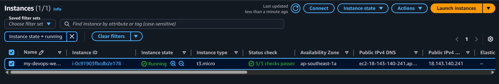
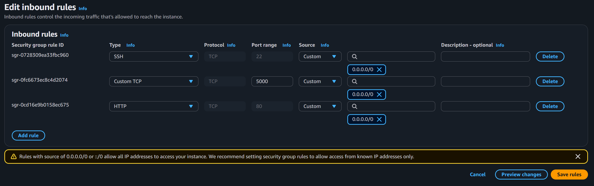
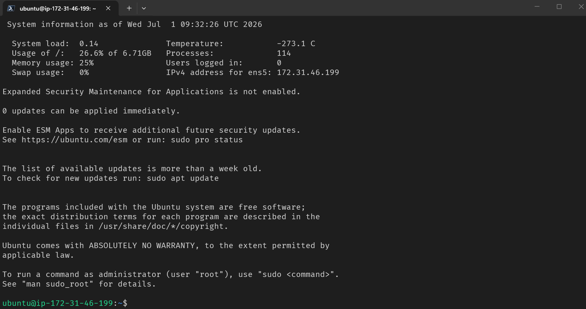
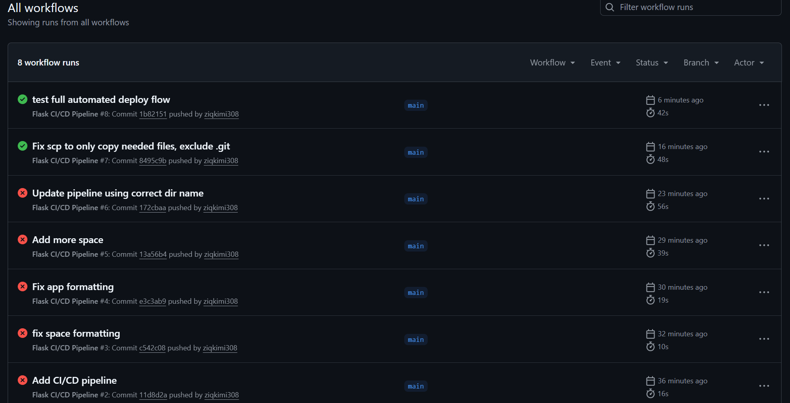
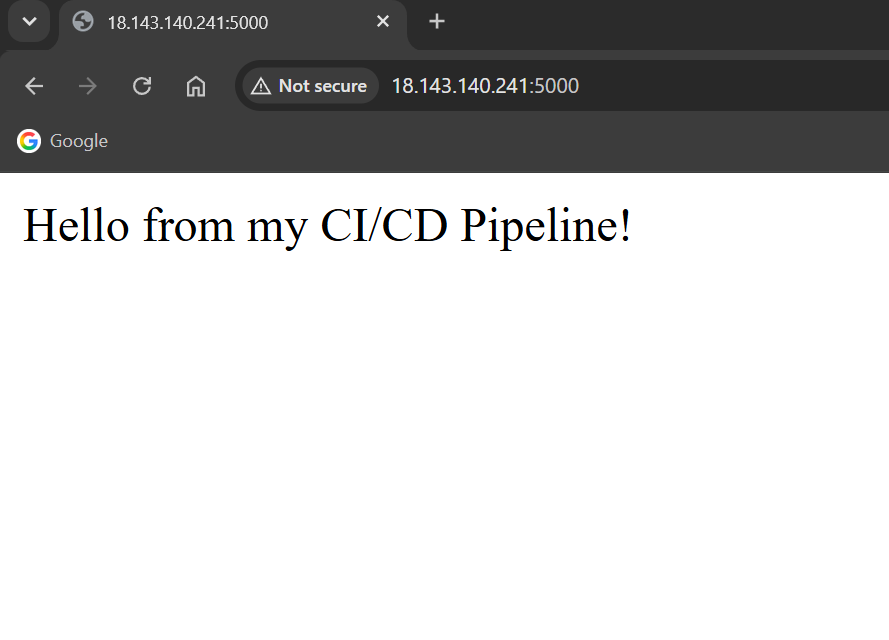
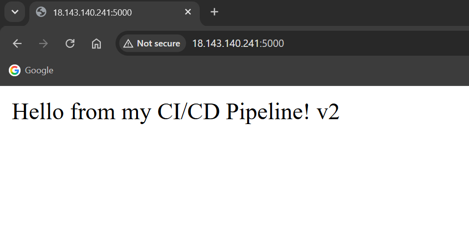

# Flask CI/CD Pipeline (GitHub Actions → EC2)

A Flask app with an automated GitHub Actions pipeline: every push to `main` runs lint → test → deploy, with deploy SSHing into EC2 to restart the live app — no manual deployment steps.


---

## 🔄 Pipeline Flow

```
git push (main)
      │
      ▼
┌───────────┐   fail   ┌──────────┐
│   Lint    │ ───────► │  STOPPED  │
│  (flake8) │          └──────────┘
└─────┬─────┘
      │ pass
      ▼
┌───────────┐   fail   ┌──────────┐
│   Test    │ ───────► │  STOPPED  │
│  (pytest) │          └──────────┘
└─────┬─────┘
      │ pass
      ▼
┌────────────────┐
│     Deploy      │
│ SSH → scp files  │
│ → restart app    │
│    (EC2)         │
└────────────────┘
      │
      ▼
  Live at http://<EC2_IP>:5000
```

---

## 🛠️ What I Built

- **Flask app** (`app.py`) with a `/` route and a `/health` check endpoint
- **Pytest test suite** (`test_app.py`) covering both routes
- **3-stage GitHub Actions pipeline** (`.github/workflows/cicd.yml`):
  - `lint` → flake8 style check
  - `test` → pytest, gated behind lint passing
  - `deploy` → gated behind tests passing, only runs on direct pushes to `main` (not PRs)
- **Credentials handled via GitHub Secrets** (`EC2_HOST`, `EC2_USER`, `EC2_SSH_KEY`) — nothing hardcoded in the repo
- **Deploy step**: copies `app.py`, `test_app.py`, `requirements.txt` to EC2 via `scp`, then SSHs in to run `start.sh`, which kills the old process and restarts the app

---

## 📸 Screenshots








---

## 💡 Key Concepts Practiced

- Stage-gating with `needs:` — broken code never reaches deploy
- `if: github.ref == 'refs/heads/main'` to stop PRs from triggering deploys
- Storing and referencing secrets safely (`${{ secrets.NAME }}`)
- Debugging a real SSH-based deploy pipeline: security group scoping, `.pem` permissions, `scp` excluding `.git`, and script path errors
- Difference between a pipeline "succeeding" and the app actually being reachable — always verify both

---

## 🐛 Real Issues Hit & Fixed (worth remembering)

| Issue | Cause | Fix |
|---|---|---|
| `ssh-keyscan` failed in pipeline | EC2 security group only allowed SSH from my own IP | Opened port 22 to `0.0.0.0/0` (key-only auth is the actual protection) |
| `scp` failed copying `.git/objects/*` | Recursive `scp -r ./` tried to copy the whole repo including read-only git internals | Changed to explicit file list (`app.py test_app.py requirements.txt`) instead of `-r ./` |
| `start.sh` syntax error | File was accidentally saved with terminal prompt text inside it | Recreated cleanly with `nano` |
| App unreachable after "successful" deploy | `start.sh` had a hardcoded wrong folder name, so `cd` silently failed and the app never started | Fixed the path, confirmed by checking `app.log` and `ps aux` on the server |
